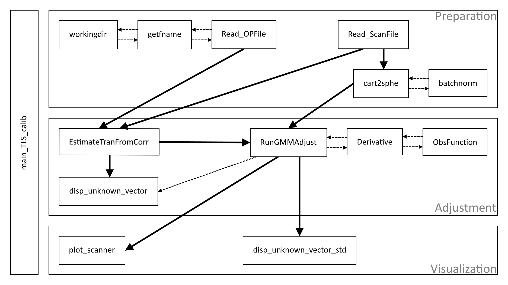
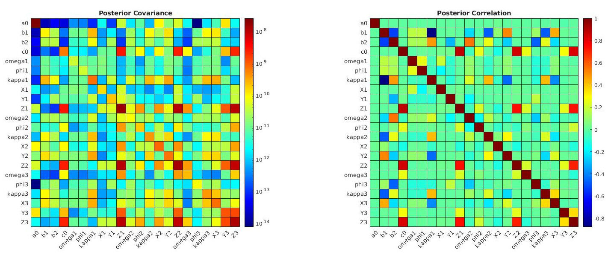
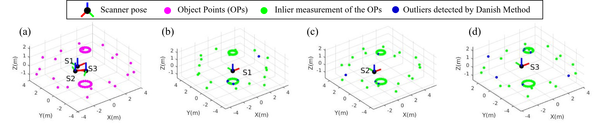

# PPE_TLSCalibration
### Codes for TLS calibration 

#### *for [project parameter estimation (PPE) course (HS2020) @ ETHZ](http://www.vvz.ethz.ch/Vorlesungsverzeichnis/lerneinheit.view?lang=en&semkez=2020W&lerneinheitId=140672&)*

#### Group member: Yue Pan & Fandré Josianne

#### Supervisor: Prof.  Andreas Wieser

#### Link to project II of PPE: [Kriging](https://github.com/YuePanEdward/PPE_Kriging)
-----

#### Goal: Parameter estimation for the extrinsic & intrinsic calibration of terrestrial laser scanner (TLS)

#### Environment and Prerequisites:  Matlab (2019 or higher) with navigation toolbox

-----

#### Implementation details:

**External loop:** robust estimation via Danish method

**Internal loop:** standard linearized parameter estimation via Gauss-Markov Model 

**Estimation of initial guess:** transformation coefficients estimation via SVD

*For more details and experiment results, please check our final report.*

#### Codes achetecture:

#### Demo:

#### 

-----

#### Reference:

[Lichiti 2007 TLS Calibration](https://www.sciencedirect.com/science/article/abs/pii/S0924271606001298):

 Lichti, Derek D. (2007). “Error modelling, calibration and analysis of an AM-CW terrestrial laser scanner system”. In: ISPRS Journal of Photogrammetry and Remote Sensing 61.5, pp. 307–324. issn: 0924-2716.

[Kubik 1980 Danish Method](https://ci.nii.ac.jp/naid/10006711980/):

Krarup, T., J. Juhl, and Kurt Kubik (Jan. 1980). “Gotterdammerung over least squares adjustment.” In: Proc. 14th Congress of the International Society of Photogrammetry, pp. 369–378. 
